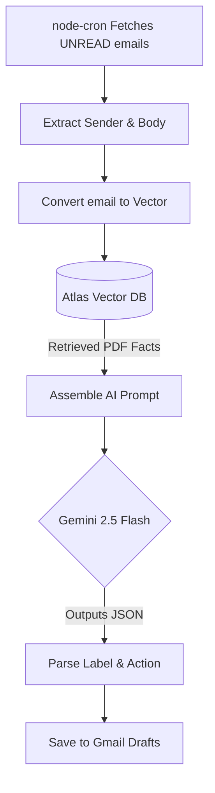

# 📨 Sendora - The Invisible AI Email Agent

Sendora is a fully autonomous, AI-driven background agent built on the Gmail API and Google's Gemini models. Unlike traditional AI writing assistants that require you to learn a new email client, Sendora operates invisibly. It reads, categorizes, and answers incoming emails using a custom **Retrieval-Augmented Generation (RAG)** pipeline—pulling exact facts from your uploaded business PDFs to generate highly accurate replies while you sleep.


---

## ✨ Key Features

*   **Invisible Autonomy:** Once connected via Google OAuth, Sendora uses backend cron jobs to monitor your inbox. You never have to abandon your native Gmail app.
*   **Custom Knowledge Base (RAG):** Upload your pricing, policies, and FAQs as PDFs. Sendora embeds these into a MongoDB Vector Database and searches them before replying, eliminating AI hallucinations.
*   **Dynamic Intent Routing:** Define custom labels (e.g., "Support", "Urgent"). Sendora categorizes the emotional intent of the sender and acts accordingly.
*   **Draft vs. Auto-Reply:** Tell the AI to either silently save perfect responses into your Drafts folder for human review or send them instantly for zero-touch automation.
*   **Persona Cloning:** Define your brand's voice (Friendly, Professional, Witty). Sendora guarantees the AI writes exactly how you would.
*   **Analytics Dashboard:** A beautiful React UI tracking total emails processed, hours of typing saved, and detailed historical logs of every AI action.

---

## 🏗️ System Architecture

Sendora operates through asynchronous background polling.



---

## 🚀 Getting Started

### Prerequisites
*   **Node.js** (v20+ recommended)
*   **MongoDB Atlas** account (required for Vector Search)
*   **Google Cloud Console** account (for OAuth and Gmail API credentials)
*   **Google AI Studio API Key** (for Gemini 2.5 Flash and embeddings)

### 1. Clone the Repository
```bash
git clone https://github.com/s4hil-dev/sendora-email-agent.git
cd sendora-email-agent
```

### 2. Environment Variables
Create a `.env` file in the `/server` directory and configure the following:

```env
MONGODB_URI=......
JWT_SECRET=......
GOOGLE_CLIENT_ID=......
GOOGLE_CLIENT_SECRET=......
GEMINI_API_KEY=......
```

### 3. Setup MongoDB Atlas Vector Search
You **must** create a Vector Search Index in your MongoDB Atlas Dashboard for the RAG feature to work.
1. Go to your Atlas Dashboard -> `knowledges` collection -> **Atlas Search**.
2. Create a new Vector Index named `vector_index`.
3. Use the following JSON configuration:
```json
{
  "fields": [
    { "type": "vector", "path": "embedding", "numDimensions": 3072, "similarity": "cosine" },
    { "type": "filter", "path": "userId" }
  ]
}
```

### 4. Install Dependencies
```bash
# Install backend dependencies
cd server
npm install

# Install frontend dependencies
cd ../frontend
npm install
```

### 5. Run the Application
You need two terminal windows open:

```bash
# Terminal 1: Start Backend (Runs on port 5000)
cd server
npm run dev

# Terminal 2: Start Frontend (Runs on port 5173)
cd frontend
npm run dev
```

---

## 🔒 Security & Privacy Notes
Sendora requires "Restricted Scopes" (`https://www.googleapis.com/auth/gmail.modify`) to read and draft emails. 
*   **Data Retention:** Sendora does **not** store the body text of your incoming emails permanently. It only stores metadata IDs for analytics to protect client privacy.
*   **OAuth:** User `refreshTokens` should be encrypted at rest in a production environment.

## 🔮 Future Roadmap
*   Migration from `node-cron` polling to **Google Cloud Pub/Sub Push Notifications** for instantaneous processing.
*   Implementation of **BullMQ** for robust background job queuing and API retry logic.
*   "Human-in-the-Loop" Tinder-style swipe dashboard for rapid draft approvals.
*   Microsoft Outlook / Office 365 integration.

---

### License
This project is licensed under the MIT License.
